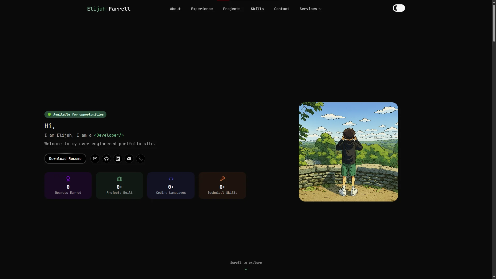

# Portfolio Website

My personal portfolio showcasing my projects, experience, and skills.



Visit my portfolio at [https://elijahfarrell.com](https://elijahfarrell.com).

## Technologies and Libraries Used

This portfolio is built using modern web technologies and libraries to provide a responsive and interactive user experience. Here are some of the key technologies and libraries used:

- **React**: A JavaScript library for building user interfaces.
- **TypeScript**: A typed superset of JavaScript that compiles to plain JavaScript.
- **Vite**: A fast build tool and development server for modern web projects.
- **Tailwind CSS**: A utility-first CSS framework for rapid UI development.
- **Three.js**: A JavaScript library for creating 3D graphics in the browser.
- **React Three Fiber**: React renderer for Three.js.
- **Framer Motion**: A library for animations in React.

## Getting Started

To run this portfolio locally:

```bash
# Install dependencies
npm install

# Start development server
npm run dev

# Build for production
npm run build

# Preview production build
npm run preview
```

The development server will start at `http://localhost:5173`
