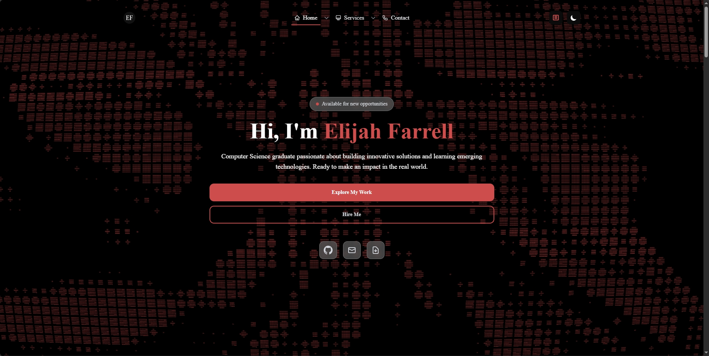

# Elijah Farrell's Portfolio

A modern, responsive portfolio built with React and TypeScript featuring dynamic theming (light/dark mode and color picker), smooth animations, and a live comment section powered by Firebase Firestore. Built with Vite for fast development and optimized performance.

## Features

- **Responsive Design**: Optimized for all screen sizes
- **Dark/Light Mode**: Theme toggle with custom color picker
- **Interactive Elements**: Smooth animations and effects
- **Live Comments**: Real-time comment system via Firebase
- **Contact Form**: EmailJS integration for seamless communication
- **Appointment Booking**: Cal.com integration for scheduling consultations
- **Modern UI**: Clean, professional design with accessibility features

## Tech Stack

- **React 18, TypeScript, Vite**
- **Tailwind CSS**
- **Firebase Firestore (comments)**
- **EmailJS (contact form)**
- **Cal.com (appointment scheduling)**
- **React Three Fiber & Drei (3D graphics)**
- **Framer Motion (animations)**

## Setup

1. **Clone the repository**
2. **Install dependencies**: `npm install`
3. **Configure environment variables** in `.env`: see [`.env.example`](./env.example)
4. **Run development server**: `npm run dev`

## Contact

- **Email**: elijah5003@gmail.com
- **GitHub**: elijah-farrell
- **Location**: Watertown, NY
- **Appointments**: [Book a consultation](https://cal.com/elijahfarrell)

## License

For the full license text, see the [LICENSE](LICENSE) file or visit https://creativecommons.org/licenses/by/4.0/

## 3D Models

This portfolio features two 3D models with seperate licenses:

- **Laptop with Code**: Based on "laptop with code" by zam205 licensed under CC-BY-4.0
- **Phone Booth**: Based on "Phone Booth" by Mountrise licensed under CC-BY-4.0

Please refer to the respective license files in the `public/` directories for full licensing information.
